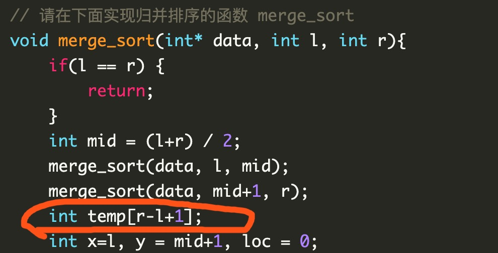

时间复杂度：$O(log_{2}N)$ （每次缩小一半）
空间复杂度：$O(n)$

使用二分查找的前提：单调性
- 若不具有单调性，可以通过定义新的数据表示，实现单调性

# 算法流程

- 假设待查找的数为 $x$，$l$ 是头指针，$r$ 是尾指针，则设 $mid = (l + r) / 2$
- 循环终止条件为 $l > r$ （待查找区间无）
  - $arr[mid] < x, l = mid + 1$
  - $arr[mid] > x, r = mid - 1$
  - $arr[mid] == x, success$

```c
// arr:待查找区间 n:区间长度 x:待查找元素
int binary_search(int *arr, int n, int x) {
    int head = 0, tail = n - 1, mid;
    while (head <= tail) {
        mid = (head + tail) / 2;
        // mid = (head + tail) >> 1;
        if (arr[mid] == x) return mid;
        if (arr[mid] < x) head = mid + 1;
        else tail = mid - 1;
    }
    return -1;
}
```

**递归写法**（任何一个有唯一解的问题都可以用递归实现）

```c
int binary_search(int *arr, int head, int tail, int x) {
    // 边界条件
    if (head > tail) return -1;
    int mid = (head + tail) >> 1;
    if (arr[mid] == x) return mid;
    if (arr[mid] < x) head = mid + 1;
    else tail = mid - 1;
    return binary_search(arr, head, tail, x);
}
```

---

# 案例讲解


斐波那契黄金分割查找

以前不行，自从 C99 标准之后，C 语言支持了变长


```bash
# 链接 静态 / 动态库
gcc xx.c -lm
```

枚举（构造）素勾股数（两两之间互素），用素勾股数枚举所有的勾股数
m，n 互素，对于 $a^2 + b^2 = c^2$ 有 
- $a = m^2 - n^2$
- $b = 2 * m * n$
- $c = m^2 + n^2$